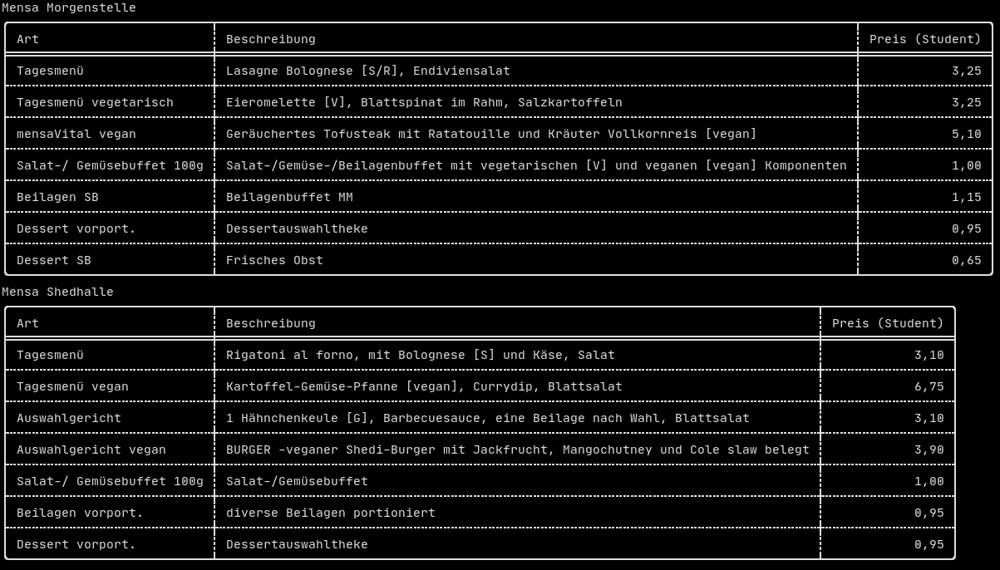

# tuemensa

`tuemensa` is a simple command-line tool designed to retrieve the current meal plan for the canteens at Eberhard Karls Universität Tübingen.
The meal data is sourced from [Studierendenwerk Tübingen - Hohenheim](https://www.my-stuwe.de/mensa/).

## Installation

To install the tool directly from [crates.io](https://crates.io/crates/tuemensa), use the command:
```sh
cargo install tuemensa
```
Alternatively, you can clone this repository and run the following command from the project root to build it:
```sh
cargo build -r
```


## Usage

Available options:

- `-m`, `--morgenstelle`  Display the meal plan for Mensa Morgenstelle
- `-w`, `--wilhemstrasse`     Display the meal plan for Mensa Wilhelmstraße
- `-p`, `--prinzkarl` Display the meal plan for Mensa Prinz Karl
- `--plaintext`       Output the meal plan in plain text format
- `-o`, `--oneline`       Use very short format (oneline)
- `-d`, `--days <DAYS>`   Specify the number of days ahead to display (valid inputs 0-7) [default: 0]
- `-v`, `--vegetarian`    Display only the vegetarian menu options
- `-h`, `--help`          Print help information
- `-V`, `--version`       Print version information

### Examples

To display the current meal plan for both Mensa Morgenstelle and Wilhelmstraße:

```sh
tuemensa -w -m
```
Example screenshot:



To view the meal plan for the following day:

```sh
tuemensa -w -d 1
```

For a compact view, which is useful for integration into desktop widgets, you can use the oneline option:

```sh
tuemensa -w -o
```

Example screenshot:


For KDE users, this functionality can be achieved with the Plasma 5 Applet [Command Output](https://store.kde.org/p/1166510/).

